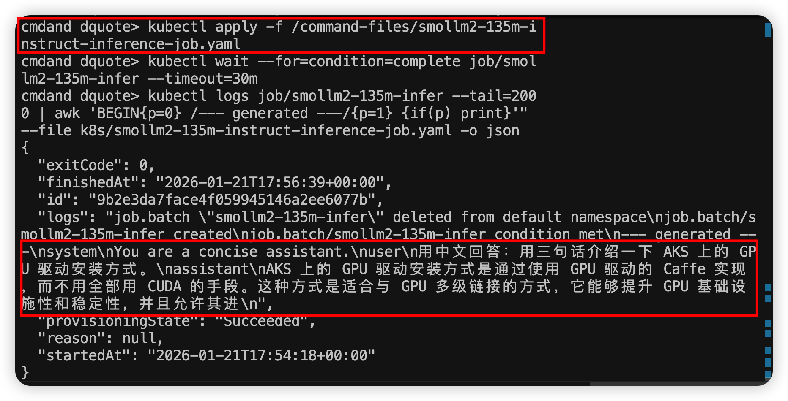

# aks-rtxpro6000

## 介绍

这个仓库是一份“从零到可验证 GPU 推理”的 AKS（Azure Kubernetes Service）测试跑通手册与配套 Kubernetes 清单。

本次测试基于 Azure 上的 **RTX Pro 6000** GPU 虚拟机规格：`Standard_NC128lds_xl_RTXPRO6000BSE_v6`，并将其作为 AKS 的 GPU 节点池（node pool）加入集群，在该 GPU 节点上完成驱动/插件安装与模型推理验证。该 GPU 属于 NVIDIA **Blackwell** 架构（日志中可见 `sm_120`），节点侧启用 MIG（Multi-Instance GPU），因此在容器内看到的设备名可能类似 *“NVIDIA RTX Pro 6000 Blackwell … MIG …”*。

目标是：

1. 在 **Azure Central US EUAP（`centraluseuap`）** 创建一个开发/测试级别 AKS 集群（API Server 公网可访问，使用 authorized IP ranges 做访问控制）。
2. 追加一个 **RTX Pro 6000 Blackwell** 的 GPU 节点池 `rtxpro6000`（VM SKU：`Standard_NC128lds_xl_RTXPRO6000BSE_v6`，固定 1 个节点，带 taint）。
3. 采用“**宿主机安装 Microsoft GRID Driver + GPU Operator 管理容器侧组件**（toolkit/device-plugin/NFD 等）”的组合，把节点暴露出 `nvidia.com/gpu`。
4. 在集群内运行最小 GPU 验证（`nvidia-smi`）以及 HuggingFace 小模型 **SmolLM2-135M-Instruct** 的 GPU 推理作业，得到可复现的日志证据。

> 说明：该 GPU 为 Blackwell（`sm_120`）。很多稳定版 PyTorch/CUDA 组合在该架构上会遇到 `no kernel image` / `CUDA_ERROR_NO_BINARY_FOR_GPU`。本仓库的推理 Job 采用 **PyTorch nightly cu128** 来兼容 `sm_120`。

### 限制与注意事项（RTX Pro 6000 / Blackwell 作为 AKS GPU 节点）

- 区域与配额：本测试使用 `centraluseuap`（EUAP）。该 SKU 在不同订阅/区域的可用性与配额差异较大，创建失败时优先检查配额与区域可用性。
- 当前2026年1月GPU node创建时不支持azure可用区（AZ）选择。创建时确认不选中所有的AZ。
- 驱动“自动选择/自动安装”限制：针对该 RTX Pro 6000 Blackwell SKU，本测试未走 AKS 的自动 GPU Driver 管理（当前2026年1月还不支持GPU driver自动安装），而是在创建节点池时使用 `--gpu-driver None`，再通过特权 Job 在宿主机安装 Microsoft GRID runfile 驱动（见步骤 4）。
- Blackwell 软件栈兼容性：`sm_120` 是新架构，许多稳定版深度学习框架 wheel 可能尚未包含 `sm_120` 的内核，容易报 `no kernel image` / `CUDA_ERROR_NO_BINARY_FOR_GPU`。因此推理验证建议使用支持 `sm_120` 的版本（本仓库采用 PyTorch nightly `cu128`）。
- GPU 节点调度约束：GPU 节点池通常会加 taint（本仓库使用 `sku=gpu:NoSchedule`），所有要跑到 GPU 节点的 Pod 都必须配置 toleration，并最好加 `nodeSelector: agentpool=rtxpro6000`。


---

## 前置条件

- 已具备 Azure 订阅权限，并且订阅开通 EUAP 区域（`centraluseuap`）可用性。
- 本地已安装并登录：
  - `az`（Azure CLI）
  - `kubectl`
  - `helm`
- 如果你使用了 `aks-preview` 扩展：
  - `az extension add --name aks-preview --upgrade`

建议在开始前确认当前订阅：

```bash
az account show -o table
# 如需要：az account set -s <SUBSCRIPTION_ID>
```

---

## 仓库文件说明（YAML 清单）

本仓库的核心内容是可复用的 Kubernetes YAML 清单文件，分别对应“安装/对齐 GPU 运行环境”和“验证 GPU 推理”两个阶段。

- [gpu-operator-values.yaml](gpu-operator-values.yaml)
  - 用途：安装/升级 NVIDIA GPU Operator 时的 Helm values，重点是给 NFD/Operator/daemonset 增加 toleration，使其能调度到 tainted 的 GPU 节点（`sku=gpu:NoSchedule`）。

- [k8s/grid-driver-install-job.yaml](k8s/grid-driver-install-job.yaml)
  - 用途：在 GPU 节点宿主机安装 Microsoft GRID driver（runfile）。通过 `hostPath` 挂载宿主机根目录到容器内 `/host`，再 `chroot /host` 执行安装。

- [k8s/nvidia-validation-markers-job.yaml](k8s/nvidia-validation-markers-job.yaml)
  - 用途：按需写入 GPU Operator/validator 可能期望的 marker 文件（例如 `/run/nvidia/validations/.driver-ctr-ready`）。
  - 说明：`/run/nvidia/validations` 位于 GPU 节点宿主机的 `/run`（通常是 tmpfs），节点重启后可能会丢失。

- [k8s/nvidia-driver-root-sync-job.yaml](k8s/nvidia-driver-root-sync-job.yaml)
  - 用途：按需把宿主机的 `nvidia-smi`、`libcuda.so`、`libnvidia-*.so` 等同步到 `/run/nvidia/driver`，以满足 GPU Operator 组件对“driver root”的预期路径。
  - 说明：`/run/nvidia/driver` 位于 GPU 节点宿主机的 `/run`（通常是 tmpfs），不是持久安装目录；真正的驱动安装仍在宿主机系统路径（如 `/usr/bin`、`/usr/lib/x86_64-linux-gnu`）。

- [k8s/gpu-smoke-test-pod.yaml](k8s/gpu-smoke-test-pod.yaml)
  - 用途：最小 GPU 验证（Pod 申请 `nvidia.com/gpu: 1` 并运行 `nvidia-smi`），用于快速确认驱动/设备透传是否正常。

- [k8s/smollm2-135m-instruct-inference-job.yaml](k8s/smollm2-135m-instruct-inference-job.yaml)
  - 用途：SmolLM2-135M-Instruct 的 GPU 推理验证 Job（申请 `nvidia.com/gpu: 1`，使用 PyTorch nightly cu128 兼容 Blackwell `sm_120`）。

---

## 变量约定（可直接复制修改）

```bash
export LOCATION=centraluseuap
export RG=rg-aks-rtxpro6000-euap-dev
export AKS=aks-rtxpro6000-euap-dev
export GPU_POOL=rtxpro6000
export GPU_VM_SIZE=Standard_NC128lds_xl_RTXPRO6000BSE_v6

# 你的公网出口 IPv4（用于 apiserver authorized IP ranges）
export MY_IP=$(curl -4 -s https://api.ipify.org)
```

创建资源组：

```bash
az group create -n "$RG" -l "$LOCATION"
```

---

## 步骤 1：创建 AKS 集群（开发测试级别）

下面给出一个可工作的最小示例（你也可以按组织规范增加监控、策略、私有集群等能力）：

```bash
az aks create \
  -g "$RG" -n "$AKS" -l "$LOCATION" \
  --enable-managed-identity \
  --generate-ssh-keys \
  --nodepool-name system \
  --node-count 1 \
  --node-vm-size Standard_D4s_v5 \
  --node-osdisk-type Managed \
  --api-server-authorized-ip-ranges "$MY_IP/32"
```

如果你更倾向允许多个固定 IP（例如办公室 + 家里），可以更新 authorized IP ranges：

```bash
az aks update -g "$RG" -n "$AKS" \
  --api-server-authorized-ip-ranges "$MY_IP/32",<OTHER_IP>/32
```

获取 kubeconfig：

```bash
az aks get-credentials -g "$RG" -n "$AKS" --overwrite-existing
kubectl get nodes -o wide
```

> 如果你频繁更换网络导致 `kubectl` 直连 API Server 不稳定，可用 `az aks command invoke` 在集群侧执行 kubectl（无需本机直连 API Server）。

---

## 步骤 2：创建 RTX Pro 6000 GPU 节点池（固定 1 节点）

创建 GPU 节点池：

```bash
az aks nodepool add \
  -g "$RG" --cluster-name "$AKS" \
  --name "$GPU_POOL" \
  --node-count 1 \
  --node-vm-size "$GPU_VM_SIZE" \
  --node-osdisk-type Managed \
  --node-osdisk-size 256 \
  --labels gpu=nvidia sku=rtxpro6000 \
  --node-taints sku=gpu:NoSchedule \
  --gpu-driver None
```

验证节点池与 taint：

```bash
kubectl get nodes -o wide
kubectl describe node -l agentpool=$GPU_POOL | egrep -n "Taints:|Labels:" -A2
```

> 说明：我们用 `sku=gpu:NoSchedule` 作为 taint，这要求所有要上 GPU 节点的 Pod 都配置 toleration。

---

## 步骤 3：安装 NVIDIA GPU Operator（容器侧组件）

添加 Helm repo：

```bash
helm repo add nvidia https://nvidia.github.io/gpu-operator
helm repo update
```

安装 GPU Operator（使用本仓库的 tolerations 配置，保证 NFD/Operator 能在 tainted GPU 节点上工作）：

```bash
helm upgrade --install gpu-operator nvidia/gpu-operator \
  -n gpu-operator --create-namespace \
  -f gpu-operator-values.yaml \
  --version v25.10.1
```

观察组件就绪：

```bash
kubectl -n gpu-operator get pods -o wide
```

---

## 步骤 4：安装宿主机 NVIDIA GRID Driver（Microsoft 推荐 Runfile）

本仓库用一个特权 Job 通过 `hostPath` 挂载宿主机根目录到 `/host`，然后 `chroot /host` 在节点 OS 内安装驱动。

本次测试使用的驱动信息如下：

- Driver 版本：`580.105.08`（GRID for Azure）
- 安装包文件名：`NVIDIA-Linux-x86_64-580.105.08-grid-azure.run`
- 来源（Microsoft 下载站点）：
  - `https://download.microsoft.com/download/85beffdc-8361-4df4-a823-dcb1b230a7aa/NVIDIA-Linux-x86_64-580.105.08-grid-azure.run`

执行安装：

```bash
kubectl apply -f k8s/grid-driver-install-job.yaml
kubectl -n gpu-operator wait --for=condition=complete job/grid-driver-install --timeout=120m
kubectl -n gpu-operator logs job/grid-driver-install --tail=200
```

成功标志：日志中出现 `nvidia-smi` 输出，且驱动版本为 `580.105.08`。

---

## 步骤 5：补齐 GPU Operator 验证所需的 marker/driver root（如需要）

在“宿主机手工安装驱动”的模式下，GPU Operator 的部分验证/组件可能期待特定路径存在（例如 `/run/nvidia/driver`、`/run/nvidia/validations`）。本仓库提供两个一次性 Job：

1) 写入验证 marker：

```bash
kubectl apply -f k8s/nvidia-validation-markers-job.yaml
kubectl -n gpu-operator wait --for=condition=complete job/nvidia-validation-markers --timeout=20m
kubectl -n gpu-operator logs job/nvidia-validation-markers
```

2) 将宿主机侧关键二进制/库同步到 `/run/nvidia/driver`：

```bash
kubectl apply -f k8s/nvidia-driver-root-sync-job.yaml
kubectl -n gpu-operator wait --for=condition=complete job/nvidia-driver-root-sync --timeout=20m
kubectl -n gpu-operator logs job/nvidia-driver-root-sync --tail=200
```

最后检查节点是否已经暴露 GPU 资源：

```bash
kubectl get node -l agentpool=$GPU_POOL -o jsonpath='{.items[0].status.allocatable.nvidia\.com/gpu}'
# 期望输出：1
```

---

## 步骤 6：最小 GPU 验证（Pod 内运行 nvidia-smi）

```bash
kubectl apply -f k8s/gpu-smoke-test-pod.yaml
kubectl wait --for=condition=Ready pod/gpu-smoke-test --timeout=10m || true
kubectl logs pod/gpu-smoke-test
```

成功标志：Pod 日志输出 `nvidia-smi`，且没有 `FailedScheduling`（如有，通常是 toleration / nodeSelector / 资源不足问题）。

---

## 步骤 7：运行 SmolLM2（HuggingFaceTB/SmolLM2-135M-Instruct）GPU 推理测试

该 Job 会：

- 调度到 `agentpool=rtxpro6000` 的 GPU 节点
- 请求 `nvidia.com/gpu: 1`
- 安装 `torch` **nightly cu128**（兼容 Blackwell `sm_120`）
- 拉取模型并在 GPU 上执行 `generate()`

执行：

```bash
kubectl apply -f k8s/smollm2-135m-instruct-inference-job.yaml
kubectl wait --for=condition=complete job/smollm2-135m-infer --timeout=30m
kubectl logs job/smollm2-135m-infer --tail=300
```

可用下面命令抽取关键证据（torch 版本 / CUDA 可用 / 设备名 / 生成结果段）：

```bash
kubectl logs job/smollm2-135m-infer --tail=2000 | egrep -n '^(model:|torch:|cuda available:|arch list:|device:|--- generated ---)'
```

运行结果示例截图：



---

## 常见问题与排障要点

### 1) `kubectl` 连接 API Server 超时

如果你启用了 `--api-server-authorized-ip-ranges`，当出口 IP 变化时本机 `kubectl` 可能会出现超时。

- 更新 authorized IP：

```bash
MY_IP=$(curl -4 -s https://api.ipify.org)
az aks update -g "$RG" -n "$AKS" --api-server-authorized-ip-ranges "$MY_IP/32",<OTHER_IP>/32
```

- 或者临时使用：

```bash
az aks command invoke -g "$RG" -n "$AKS" --command "kubectl get nodes -o wide" -o json
```

### 2) Pod Pending / FailedScheduling

GPU 节点带 taint：`sku=gpu:NoSchedule`。

- 需要同时具备：
  - `nodeSelector: { agentpool: rtxpro6000 }`
  - toleration：`sku=gpu:NoSchedule`
  - `resources.limits.nvidia.com/gpu: 1`

### 3) `no kernel image` / `CUDA_ERROR_NO_BINARY_FOR_GPU`

Blackwell（`sm_120`）在很多稳定版 wheel 上还没有完整覆盖，尤其是 PyTorch/CuPy 的特定版本组合。

- 本仓库的 SmolLM2 Job 使用：
  - `pip install --pre --index-url https://download.pytorch.org/whl/nightly/cu128 torch`

---

## 成本控制（停止/启动集群）

当你不需要集群时，可以停止 AKS 以节省节点计算费用：

```bash
az aks stop -g "$RG" -n "$AKS"
```

需要继续测试时再启动：

```bash
az aks start -g "$RG" -n "$AKS"
```

> 停止 AKS 后通常仍会继续计费的资源：托管磁盘（PV）、公网 IP / Load Balancer、ACR 等。

---

## 总结

- 通过“**GPU 节点池（固定 1 节点）+ GPU Operator（容器侧组件）+ 宿主机 GRID Driver（runfile）**”的路径，可以在 AKS 上稳定地暴露 `nvidia.com/gpu` 并运行 GPU 工作负载。
- 针对 RTX Pro 6000 Blackwell（`sm_120`），推理测试建议优先使用 **PyTorch nightly cu128** 以避免二进制不兼容。
- 本仓库的清单文件覆盖了：驱动安装、验证标记、driver root 同步、最小 nvidia-smi 验证、以及 SmolLM2 GPU 推理端到端测试，便于复现与回归验证。
